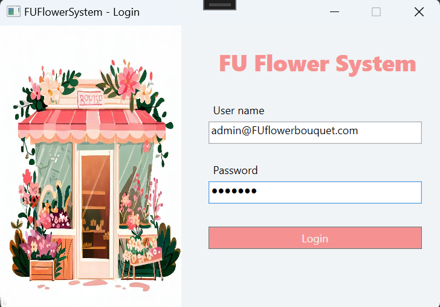

# Flower Shop Management System

:wave: This project is my personal assignment for the  PRN221-Sum23 course at FPTU HCMC. :wave:

## Table of Contents
  - [Description](#description)
  - [Preview Screenshot](#preview-screenshot)
  - [Technology](#technology)
  - [Functional requirements](#functional-requirements)
  - [References](#references)
  - [License & Copyright](#license--copyright)

## Description
- This project is a Windows Presentation Foundation (WPF) application that helps manage a flower shop, including supplier management, flower bouquet management, customer management, and order management.
- This project started from 23-05-2023 to 25-05-2023

## Preview Screenshot

 </img>
   
 </img> &nbsp;&nbsp; 
 </img>
    
 </img> &nbsp;&nbsp; 
 </img>
   
 </img>

## Technology
**1. Frontend:** Windows Presentation Foundation (WPF)

**2. Backend:** ASP.NET 7

**3. Database:** MSSQL Server 19

**4. Concepts and Patterns:** Entity Framework Core, LINQ, 3-Layers architecture, MVVM (Model-View ViewModel) pattern, Repository pattern, Singleton pattern.

**5. Tool:** MS Visual Studio

## Functional requirements
**1. Admin:**
- [x] Manage customer information (CRUD operations with search and popup dialogs for create/update actions)
- [x] Manage flower bouquet information (Deletion with confirmation and status management)
- [x] Manage order information (including order details)
- [x] Generate report statistics by period and sort sales in descending order

**2. Customer:**
- [x] Manage their profile
- [x] View order history

**Common Features:**
- [x] Authentication by Email and Password for Admin and Customer roles
- [x] Confirmation dialog for deletion actions

## References
- [C# WPF UI | How to Design Flat Data Table Dashboard in WPF - Youtube](https://www.youtube.com/watch?v=mlmyFXJy8gQ)

## License & Copyright 
&copy; 2024 LamVo

This project is licensed under the MIT License. See the [LICENSE](./LICENSE) file for details.
